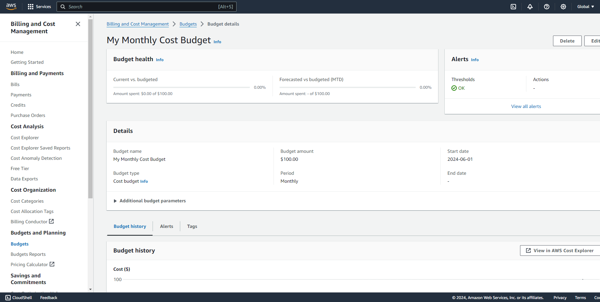

# Lab 7
- [x] 1. Tạo Budget

- [x] 2. Tạo Cost Budget

- [ ] 3. Tạo Usage Budget - Lý do: Usage type không hiện EC2

- [ ] 4. Tạo RI Budget - Lý do: No services found

- [x] 5. Tạo Savings Plans Budget

- [x] 6. Dọn Dẹp Tài Nguyên
