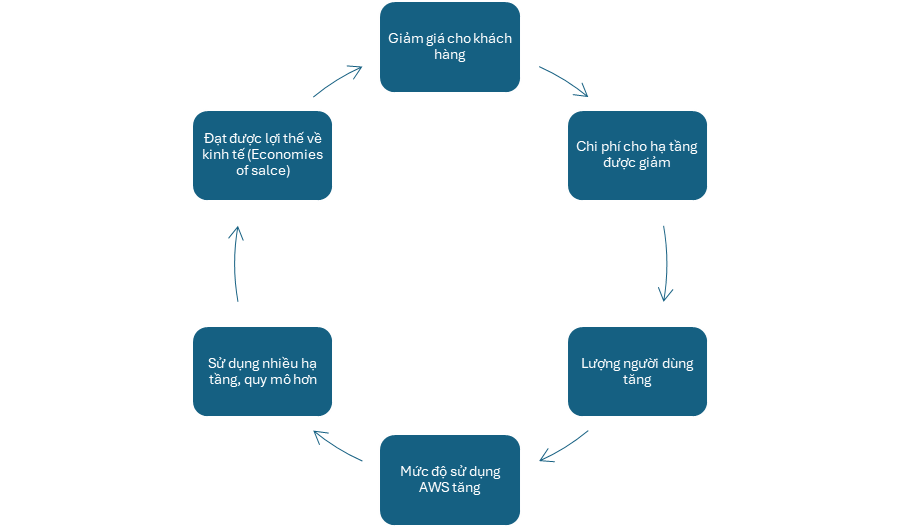
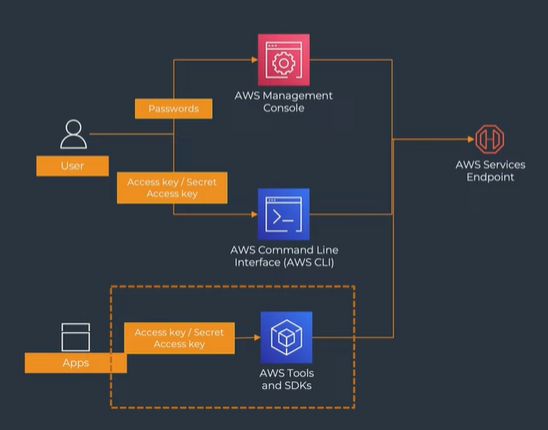

[TOCM]

# Module 1

## 1. Điện toán đám mây là gì?
Điện toán đám mây là việc **phân phối các tài nguyên CNTT** **theo nhu cầu** qua internet với chính sách **thanh toán theo mức sử dụng**.

**Ví dụ:** người dùng (có xác thực) muốn triển khai ứng dụng, web, cần 1 máy chủ, thay vì mua rồi setup thì thuê dịch vụ đtđm, bên dịch vụ đtđm sẽ cung cấp theo yêu cầu, xài bao nhiêu bao lâu thì tính tiền bấy nhiêu.

### Lợi ích
- Sử dụng bao nhiêu tính tiền bấy nhiêu, cung cấp khả năng tối ưu chi phí.
- Tăng tốc độ phát triển, nhờ tận dụng các tính năng tự động hoá và quản trị bởi nhà cung cấp dịch vụ.
- Linh hoạt, thêm bớt các tài nguyên tuỳ ý. VD: nay dùng 2 CPU, mai lượng truy cập ứng dụng tăng -> dễ dàng nâng số CPU.
- Khả năng mở rộng quy mô ứng dụng lên toàn cầu.

## 2. Điều gì tạo nên sự khác biệt của AWS?
AWS là nhà cung cấp ha tầng điện toán đám mây dẫn đầu trong 13 năm liên tiếp (đến hết năm 2023) – theo báo cáo của Gartner.
AWS là nhà cung cấp khác biệt về tầm nhìn và văn hoá.
> Triết lý về giá của AWS: càng ngày càng trả ít tiền hơn cho cùng dịch vụ/tính năng/tài nguyên sử dụng.

### Sự khác biệt khác:
với các nhà cung cấp khác, cho dùng thử giá rẻ, sau đó giá cao -> AWS không làm như vậy.

### Triết lý, văn hoá của AWS được thể hiện thông qua các nguyên tắc lãnh đạo của mình.
+ **Customer Obsession**: Đặt khách hàng làm ưu tiên hàng đầu. VD: kỹ thuật viên, nhân viên tư vấn ko chịu áp lực về KPI sẽ tư vấn cho khách hàng tốt nhất có thể, ngược lại nếu chịu áp lực về KPI thì sẽ tư vấn cho khách hàng dùng càng nhiều càng tốt.
+ **Ownership**: làm việc cho công ty, cho tổ chức, nhưng xem đó là việc của mình, luôn nghĩ cách tốt nhất để phát triển công ty.
+ …

## 3. Bắt đầu hành trình lên mây
Lộ trình học: https://aws.amazon.com/vi/training/learn-about/

## 4. Hạ tầng toàn cầu của AWS
### Trung tâm dữ liệu của AWS
Một trung tâm dữ liệu (data center) có thể chứa rất nhiều máy chủ
Tất cả data center của AWS đều được sử dụng các thiết bị được tối ưu hoá dành riêng cho hoạt động của AWS.
> Muốn đánh giá hiệu năng của các máy chủ khác nhau thì nên đánh giá bằng hiệu năng thực tế.

Tham khảo: https://aws.amazon.com/vi/about-aws/global-infrastructure/

### Availability Zone (AZ)
Một AZ bao gồm 1 hoặc nhiều data center, các AZ được thiết kế để không xảy ra sự cố ảnh hưởng đồng thời 2 AZ một lúc (fault isolation – cô lập lỗi).
Giữa 2 AZ là đường kết nối riêng tốc độ cao.
AWS khuyến nghị nên triển khai ứng dụng tối thiểu trên 2 AZ.
> Đi thi lấy chứng chỉ thì sẽ có câu này, nhưng trên thực tế, tuỳ trường hợp thì không cần triển khai trên 2 AZ, triển khai trên 1 AZ - sau đó backup lại.

### Region (Khu vực)
Một AWS Region bao gồm tối thiểu 3 AZ. Hiện tại, theo trang web của AWS, có 33 Region với tổng cộng 105 AZ, và dự kiến sẽ bổ sung thêm 6 Region và 18 AZ trên toàn cầu.
Các Region được kết nối với nhau bởi mạng backbone của AWS.
Mặc định dữ liệu và dịch vụ ở các Region độc lập với nhau. (Trừ một số dịch vụ ở quy mô Global). VD: khách hàng ở VN thì nên chọn Region gần đó (Singapore) để tối ưu độ trễ. Có một số dịch vụ đặc thù (dịch vụ mới, dịch vụ đang phát triển) thì sẽ bị hạn chế về Region.
> Có thể thấy nguyên tắt Customer Obsession và văn hoá của AWS ở đây:
Hạ tầng mở lâu -> Khách hàng nhiều -> Mức sử dụng cao -> Giá càng rẻ.
VD: Region ở Mỹ sẽ rẻ hơn Region ở Sing…
Vậy, nếu chạy test, có thể chọn các region rẻ để tối ưu chi phí

### Edge Locations
Là mạng lưới data center của AWS được thiết kế để cung cấp dịch vụ với độ trễ thấp nhất có thể.
Các dịch vụ AWS hoạt động tại Edge Locations (POP – Points of Present) bao gồm:
+ CloudFront (CDN – Content Delivery Network) giúp caching dữ liệu người dùng duyệt web. 
+ Web Application Firewall (WAF) là một dịch vụ firewall layer 7.
+ Route 53 (DNS Service) – có thể tạo domain cho ứng dụng web.

Hiện ở VN có 2 Edge Locations: 1 ở HCM, 1 ở HN.

## 5. Công cụ quản lý AWS Services
- Root login: là tài khoản đăng ký AWS Account đầu tiên, gồm email, username, pasword. Cực kỳ quan trọng, thông thường sẽ hạn chế sử dụng
- IAM login: IAM user không là một AWS Account hoàn chỉnh, chỉ là một user con giúp chúng ta truy xuất, quản lý các tài nguyên của AWS.
- Account ID: chuỗi 12 chữ số
- Service Search: tìm kiếm các dịch vụ, mỗi một dịch vụ sẽ có trang management riêng cho phép sử dụng các tính năng của dịch vụ đó.
- Support Center: tạo support case để yêu cầu hỗ trợ từ đội ngũ của AWS.
- AWS Command Line Interface (CLI): một công cụ mã nguồn mở cho phép tương tác với các dịch vụ AWS bằng cách sử dụng các câu lệnh; cho phép chạy các lệnh triển khai chức năng tương đương với chức năng được cung cấp bởi AWS Management Console.
- AWS SDK: đơn giản hoá việc sử dụng AWS services cho ứng dụng bằng cách cung cấp một bộ thư viện nhất quán và quen thuộc cho team dev.
	- AWS SDK cung cấp hỗ trợ cho việc quản lý vòng đời của API tới AWS Services như manage credentials – retry – data marshalling – serialization – deserialization.

## 6. Tối ưu hoá chi phí trên AWS
- Lựa chọn cấu hình tài nguyên tính toán và nơi lưu trữ phù hợp.
- Tận dụng các phương thức thanh toán giảm giá.
- Xoá các tài nguyên không dùng, bật tắt tự động các tài nguyên không cần chạy 24/7.
- Tận dụng các dịch vụ serverless.
- Thiết kế kiến trúc tối ưu để giải quyết yêu cầu đề ra.
- Cài đặt và sử dụng AWS Budget.
- Quản lý chi phí theo phòng ban / ứng dụng với cost allocation tag.
- Liên tục theo dõi và tối ưu chi phí.

**Sử dụng https://calculator.aws/# để tính toán chi phí ước lượng cho các dịch vụ và tài nguyên sử dụng.**

Có 4 gói 
1. **Gói Basic**
Gói Basic cung cấp hỗ trợ cơ bản cho các vấn đề liên quan đến tài khoản và thanh toán cùng với các yêu cầu tăng thêm hạn mức cho tài khoản.
Tất cả khách hàng của AWS được cung cấp truy cập 24/7 vào các tính năng sau của gói hỗ trợ Basic:
	- Phòng chat trực tiếp 1-1 cho các câu hỏi về tài khoản và thanh toán.
	- Diễn đàn hỗ trợ.
	- Kiểm tra Dịch vụ.
	- Tài liệu, tài liệu kĩ thuật và các hướng dẫn best practice.

2. **Gói Developer**
Đối với gói Developer, các tính năng được hỗ trợ sẽ được mở rộng hơn với:
	- Các chỉ dẫn thực hiện best practice.
	- Hỗ trợ xây dựng kiến trúc khối: Chỉ dẫn cách sử dụng và kết hợp các sản phẩm, tính năng và dịch vụ của AWS.
	- Hỗ trợ không giới hạn các yêu cầu hỗ trợ được tạo bởi tài khoản gốc (root user).

3. **Gói Business**
Khi nâng lên gói hỗ trợ Business, bạn sẽ có thêm các hỗ trợ sau:
	- Chỉ dẫn theo Use-case cụ thể: Đưa ra lời khuyên về lựa chọn các sản phẩm, tính năng và dịch vụ của AWS hỗ trợ tốt nhất cho nhu cầu của bạn.
	- AWS Trusted Advisor: Chức năng tự động khảo sát môi trường sử dụng của khách hàng và xác định cơ hội tiết kiệm chi phí, giảm thiểu rủi ro an ninh và tăng cường độ tin cậy và hiệu suất của hệ thống.
	- Hỗ trợ sử dụng AWS Support API: Tương tác với Support Center và Trusted Advisor qua API để tự động quản lý yêu cầu hỗ trợ và vận hành AWS Trusted Advisor.
	- Hỗ trợ về phần mềm bên thứ ba: Hỗ trợ hệ điều hành và cấu hình máy ảo EC2, cùng với hiệu suất của các ứng dụng phổ biến trên nền tảng AWS.
	- Hỗ trợ không giới hạn các yêu cầu hỗ trợ được tạo bởi tất cả các IAM User.

4. **Gói Enterprise**
Thêm vào đó, với khách hàng sử dụng gói Enterprise sẽ có thêm các đặc quyền về tính năng như sau:
	- Chỉ dẫn về kiến trúc phần mềm: Lời khuyên về cách phối hợp dịch vụ AWS để giải quyết vấn đề về ứng dụng hoặc tải trọng công việc.
	- Quản lý sự kiện hạ tầng: Phân tích chuyên sâu về use-case của bạn và cung cấp hướng dẫn về quy mô và kiến trúc phù hợp cho sự kiện cụ thể.
	- Technical Account Manager: Sự hỗ trợ thường trực từ Technical Account Manager (TAM) giải quyết các vấn đề liên quan đến tình huống và ứng dụng của bạn.
	- Ưu tiên và chăm sóc đặc biệt cho các yêu cầu hỗ trợ
	- Hỗ trợ đánh giá Quản lý Doanh nghiệp.

## 7. AWS Well Architect Framework
...
